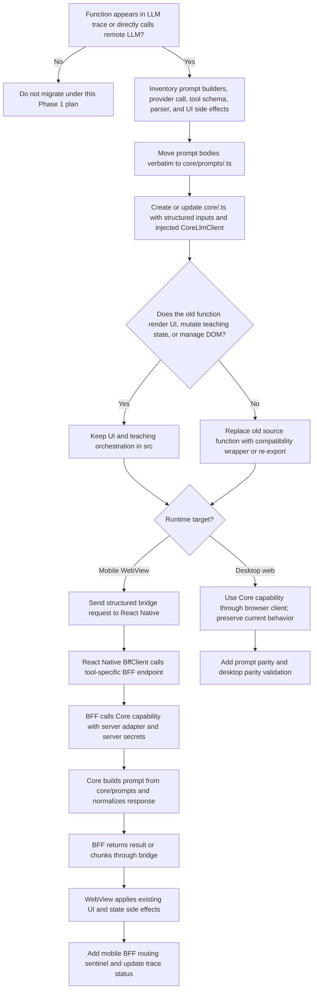

# Mobile LLM Proxy Phase 1 Master Migration Plan

Created: 2026-06-02

This document is the authoritative Phase 1 migration plan for moving Recursive Sensei mobile LLM execution to the server while preserving the existing web application behavior. Future engineers and Codex sessions must use this document as the first reference for this migration.

When this document conflicts with older mobile architecture documents, BFF implementation notes, or the proposed `src/llmGateway.ts` abstraction in `docs/llm_entry_exit_traces.md`, this document wins for Phase 1 mobile LLM migration.

## 0. History And Final Intent

The project started as a web application being transplanted into a mobile app through a React Native shell and WKWebView. During that transplant, the major security and operations flaw became clear: the mobile app bundle could still execute remote LLM calls directly and could carry prompt logic that could not be changed after the app was shipped.

The first migration intent was broad. The plan was to separate UI-facing code from application logic so that most business logic, teaching state, pedagogy decisions, prompt assembly, and LLM execution would move into the server side. That was architecturally clean, but it was also a large migration. It implied moving a significant portion of the teaching runtime out of the web application and into BFF/Core.

The project then changed intent. The final Phase 1 migration is deliberately smaller: only code that directly builds prompts for remote LLM execution, directly calls remote LLM APIs, parses LLM tool or JSON responses, or owns LLM-facing request/response contracts is moved into Core and exposed through BFF for mobile. The web application keeps its current teaching orchestration and UI behavior.

The final goal is not "move the app to the server." The final goal is "make mobile LLM execution server-owned while preserving existing web behavior and avoiding a large business-logic migration."

## 1. Migration Goal

The migration has five goals:

1. Mobile must not execute remote LLM provider calls directly.
2. Mobile must not depend on prompt text bundled inside the shipped mobile app for migrated LLM capabilities.
3. Server-side prompt changes must be possible without updating already shipped mobile apps.
4. Existing desktop web behavior must be preserved unless a later document explicitly changes it.
5. The migration must be the fastest low-friction route: move only LLM-facing functions and prompt builders, not the whole teaching state machine.

The migration is successful when every LLM-facing function listed in this document has:

1. Canonical prompt builders in `core/prompts/<capability>.ts`.
2. A Core capability function that accepts structured inputs and an injected `CoreLlmClient`.
3. A BFF endpoint or BFF service method for mobile.
4. A React Native bridge route from WebView to BFF for mobile.
5. A desktop web path that continues working with the existing browser behavior.
6. Tests or golden fixtures proving prompt parity and response parsing parity.

## 2. Non-Goals

Phase 1 must not migrate the full teaching runtime to BFF. The following stay in the web application unless a future plan explicitly changes scope:

1. DOM rendering and UI orchestration.
2. Chat transcript rendering.
3. Teaching state progression that is not itself an LLM call.
4. Selection UI behavior and toolbar state.
5. Curriculum state and module flow orchestration, except for structured data needed as input to a migrated LLM capability.

Phase 1 must not introduce a generic frontend `src/llmGateway.ts` that merely hides direct provider calls. That idea reduces call-site noise, but it does not solve the mobile server-ownership requirement unless every mobile call is routed through BFF. Tool-specific Core capabilities and tool-specific BFF endpoints are the required standard.

Phase 1 must not rewrite prompts for style or quality during migration. Prompt text moves verbatim first. Prompt improvements happen only after parity has been proven.

## 3. Naming And Ownership

Use these names consistently:

1. Core: the shared TypeScript library under `core/`. Core is not the BFF. Core owns canonical prompt builders, LLM-facing tool logic, response schemas, parsers, normalizers, and typed capability functions.
2. BFF: the backend-for-frontend server under `bff/`. BFF owns mobile HTTP endpoints, session-aware request handling, provider adapter construction, server secrets, telemetry, and server execution of Core capabilities.
3. Desktop web: the normal browser version of the web app under `src/`.
4. Mobile WebView: the same web app bundle loaded inside the React Native iOS app.
5. React Native shell: the native app under `SenseiMobile/`, including `BffClient`, WebView bridge code, and native-to-BFF transport.

The Core/BFF split is mandatory:

1. Core must not own HTTP route definitions.
2. BFF must not own prompt bodies.
3. Mobile WebView must not call provider SDKs for migrated capabilities.
4. Desktop web may continue direct provider execution through a browser `CoreLlmClient` while Phase 1 is active.

## 4. Migration Architecture

### Desktop Web Flow

Desktop web preserves current behavior while gradually using Core capability functions:

```text
Desktop browser UI
  -> src wrapper or existing caller
  -> core/<capability>.ts
  -> core/prompts/<capability>.ts
  -> browser CoreLlmClient
  -> remote LLM provider
  -> Core parser/normalizer
  -> existing web UI/state code
```

Desktop web can still contain browser provider setup during Phase 1. The provider call must be behind an injected client or compatibility wrapper for migrated capabilities, not duplicated inside each old feature file.

### Mobile WebView Flow

Mobile must use BFF for every migrated LLM capability:

```text
Mobile WebView UI/state code
  -> mobile runtime detection
  -> structured bridge request
  -> React Native bridge handler
  -> SenseiMobile BffClient
  -> BFF endpoint or service
  -> Core capability function
  -> core/prompts/<capability>.ts
  -> server CoreLlmAdapter / GeminiGateway
  -> remote LLM provider
  -> Core parser/normalizer
  -> BFF response or stream chunks
  -> React Native bridge response
  -> Mobile WebView applies existing UI/state behavior
```

The mobile WebView sends structured inputs to BFF. It must not send a finished prompt string as the authoritative migrated runtime input. Finished prompt construction must happen server side through Core prompt builders so prompt changes can ship without a mobile app update.

### Streaming Flow

Streaming capabilities still follow the same ownership:

```text
Mobile WebView requests stream with structured inputs
  -> React Native bridge opens BFF stream
  -> BFF calls Core prompt builder and provider stream
  -> BFF emits text chunks/events
  -> React Native forwards chunks to WebView
  -> WebView applies existing rendering and teaching state updates
```

Core owns prompt construction and response normalization. WebView owns chunk application, DOM updates, scroll behavior, and teaching-state side effects.

## 5. Prompt Ownership And Migration Standard

The prompt standard is intentionally strict:

1. Every prompt body must live in `core/prompts/<capability>.ts`.
2. `core/prompts/index.ts` may re-export prompt builders, but it must not contain prompt bodies.
3. `src/prompts.ts` must become a compatibility facade for migrated prompts. After a prompt is migrated, `src/prompts.ts` re-exports or delegates to Core. It must not retain a second copy of the same prompt body.
4. BFF must not contain prompt bodies.
5. Core capability files such as `core/teachingPlan.ts` or `core/wrapUpAssessment.ts` must not keep prompt bodies after the prompt normalization phase. They import builders from `core/prompts/<capability>.ts`.
6. Prompt text must be copied verbatim during migration. No content edits, cleanup, formatting rewrites, or prompt quality improvements are allowed in the same change that moves a prompt.
7. Prompt builders must accept structured domain inputs, not UI objects or DOM nodes.
8. Mobile migrated runtime must use prompts from Core through BFF. It is acceptable for old unused prompt text to remain in a bundled file temporarily only before that prompt has been migrated. Once migrated, there must be one prompt body source of truth.

The existing completed migrations already moved several prompt builders into Core capability files. That work is valid as a functional first step, but it is not the final prompt standard. The next normalization step must move those prompt bodies into `core/prompts/<capability>.ts` and update Core capability files to import them.

### Why Not Keep One Giant Prompt File?

The old `src/prompts.ts` file is a frontend-owned prompt file. Keeping it as the canonical source would keep mobile prompt behavior tied to the app bundle and would not satisfy the server-update goal.

The new standard keeps one canonical prompt root, `core/prompts/`, while separating prompt files by capability. This prevents a giant cross-feature file from becoming a fragile merge hotspot, but it also prevents different implementations. Every prompt follows the same rule: prompt bodies live under `core/prompts/`, never in `src/`, never in `bff/`, and never inline beside a migrated provider call.

## 6. LLM-Facing Function Inventory

This list is sourced from `docs/llm_entry_exit_traces.md` and reconciled with the current migration direction.

| Capability | Current source entry point | Current implementation status | Remaining migration work | Required Core prompt file | Required Core capability | Required BFF/mobile route |
| --- | --- | --- | --- | --- | --- | --- |
| Wrap-up assessment planner | `src/index.tsx:createLLMPlannerCallback` -> `generateWrapUpAssessment`; `src/geminiService.ts:generateWrapUpAssessment` legacy wrapper | Master-doc complete for Phase 1 scoped migration. Core owns prompt body, tool declaration, LLM execution, parsing, normalization, and validation; BFF/mobile route exists; desktop wrapper delegates to Core. | No remaining scoped prompt-normalization work. Keep legacy wrapper as compatibility only; do not reintroduce prompt or parser bodies outside Core. | `core/prompts/wrapUpAssessment.ts` | `core/wrapUpAssessment.ts:generateWrapUpAssessment` | Existing wrap-up BFF service/endpoint and mobile bridge route |
| Teaching plan generation | `src/geminiService.ts:llmExtractAndPlanTeachingOrder`; mobile `requestTeachingPlan` bridge path | Master-doc complete for Phase 1 scoped migration. Core owns prompt bodies, LLM execution, teaching-plan parsing, and normalization; BFF route and RN/mobile bridge path exist; desktop wrapper delegates to Core. | No remaining scoped prompt-normalization work. Future changes must preserve `core/prompts/teachingPlan.ts` as the canonical prompt owner. | `core/prompts/teachingPlan.ts` | `core/teachingPlan.ts:extractAndPlanTeachingOrder` | Existing teaching-plan BFF service/endpoint and mobile bridge route |
| Learner analysis | `src/geminiService.ts:getAnalysisFromGemini`; mobile `requestLearnerAnalysis` bridge path | Master-doc complete for Phase 1 scoped migration. Core owns prompt body, misconception/schema instruction text, LLM execution, JSON parsing, and output shape; BFF route and RN/mobile bridge path exist; desktop wrapper delegates to Core. | No remaining scoped prompt-normalization work. Future changes must preserve `core/prompts/learnerAnalysis.ts` as the canonical prompt owner. | `core/prompts/learnerAnalysis.ts` | `core/learnerAnalysis.ts:getComprehensiveAnalysis` | Existing analysis BFF service/endpoint and mobile bridge route |
| Module introduction stream | `src/interactionHelpers.ts:streamModuleIntroduction` | Master-doc complete for Phase 1 scoped migration on PR branch `codex/llm-streaming-core-bff-migration`. Core owns prompt body, base instruction envelope, request type, prompt-option defaults, and capability prompt construction; BFF owns server prompt options, provider streaming, validation, and WebSocket events; RN/mobile bridge forwards stream chunks; WebView preserves chunk rendering, reload, and enhancer behavior. Key commits: `28fa4f9`, `790d9e7`, `9e0c9c8`, `f2b952a`, `ce6a3e8`. | No remaining scoped prompt-normalization or mobile-routing work. Keep desktop direct stream compatibility during Phase 1; keep mobile runtime on structured BFF/Core stream requests; keep live Gemini/manual smoke evidence as release validation, not deterministic correctness proof. | `core/prompts/moduleIntroduction.ts` | `core/moduleIntroduction.ts:buildModuleIntroductionPrompt` | `POST /sessions/:sessionId/llm-stream` plus `WS /sessions/:sessionId/llm-stream?requestId=...`; bridge events `llmStream:request` / `llmStream:status` / `llmStream:chunk` / `llmStream:error` with `capability:"moduleIntroduction"` |
| Main Sensei response stream | `src/interactionHelpers.ts:streamMainSenseiResponse` | Master-doc complete for Phase 1 scoped migration on PR branch `codex/llm-streaming-core-bff-migration`. Core owns prompt body, base instruction envelope, standard and Socratic structured request types, prompt-option defaults, bounded history envelope, and capability prompt construction; BFF owns server prompt options, provider streaming, validation, single-claim request handling, and WebSocket events; RN/mobile bridge forwards stream chunks; WebView preserves chunk rendering, Socratic/reload behavior, chronological history capture, and teaching-state orchestration. Key commits: `28fa4f9`, `790d9e7`, `9e0c9c8`, `f2b952a`, `ce6a3e8`. | No remaining scoped prompt-normalization or mobile-routing work. Keep desktop direct stream compatibility during Phase 1; keep mobile standard and Socratic runtime on structured BFF/Core stream requests; keep live Gemini/manual smoke evidence as release validation, not deterministic correctness proof. | `core/prompts/mainSenseiResponse.ts` | `core/mainSenseiResponse.ts:buildMainSenseiResponsePrompt` | `POST /sessions/:sessionId/llm-stream` plus `WS /sessions/:sessionId/llm-stream?requestId=...`; bridge events `llmStream:request` / `llmStream:status` / `llmStream:chunk` / `llmStream:error` with `capability:"mainSenseiResponse"` |
| Legacy generic BFF turn stream | `bff/src/controllers/sessionController.js:submitTurn` -> `bff/src/services/streamingService.js:handleConnection` -> `bff/src/integration/senseiCoreAdapter.js:buildPrompt` | Not migrated and not part of the completed structured `llm-stream` capability path. This legacy route still builds an inline BFF prompt for `/sessions/:sessionId/turns` plus `/sessions/:sessionId/stream?turnId=...`. | Retire this legacy generic turn/stream path as a backlog item. It must not remain a prompt-owning BFF fallback for mobile LLM execution. Existing clients should move to capability-specific structured routes such as `/llm-stream`; tests should either remove the legacy route or prove it is unreachable/disabled before release. | Not applicable; retire instead of migrating as a generic prompt | Not applicable | Remove or disable legacy `/turns` plus `/stream`; do not add a generic prompt route replacement |
| Selection Sensei follow-up | `src/selectionSensei.ts:dispatchFollowupToAI` | Complete for the unified Selection Sensei modal LLM flow as of WDG-010 final sweep. Core owns prompt/context construction, parser/normalizer behavior, and `runSelectionSenseiModalMessage`; BFF owns mobile provider execution and trust-boundary validation; BffClient/RN/WebView route structured modal messages; WebView keeps modal UI state and transcript rendering. Desktop compatibility keeps the local browser path gated outside mobile. | No remaining scoped migration work for this row. Preserve explicit stateless modal context, structured mobile bridge payloads, BFF caps, and desktop compatibility classification in future edits. | `core/prompts/selectionSensei.ts` | `core/selectionSensei.ts:runSelectionSenseiModalMessage` | `POST /sessions/:sessionId/selection-sensei/modal-message`; bridge `selectionSensei:modalMessageRequest` / `selectionSensei:modalMessageResult` |
| Selection Sensei toolbar action | `src/selectionSensei.ts:handleToolbarAction` | Complete for the unified Selection Sensei modal LLM flow as of WDG-010 final sweep. Core owns toolbar/ask prompt builders, toolbar action instructions, parser/normalizer behavior, and provider-agnostic capability execution; BFF owns mobile provider execution; BffClient/RN/WebView route structured modal messages; non-LLM actions remain local. Desktop compatibility keeps the local browser path gated outside mobile. | No remaining scoped migration work for this row. Preserve Core prompt/parser custody, structured mobile route, bridge-missing fail-closed behavior, duplicate pending guard, and local-only non-LLM actions in future edits. | `core/prompts/selectionSensei.ts` | `core/selectionSensei.ts:runSelectionSenseiModalMessage` | `POST /sessions/:sessionId/selection-sensei/modal-message`; bridge `selectionSensei:modalMessageRequest` / `selectionSensei:modalMessageResult` |
| Enhancement request | `src/enhancementManager.ts:toggleEnhancement` -> `src/enhancementRouting.ts:requestSenseiEnhancementViaRoute` / `src/mobile/webviewMessageRouter.ts:requestSenseiEnhancementViaBridge`; desktop compatibility still reaches `src/geminiService.ts:requestSenseiEnhancement` | PR-stage deterministic migration evidence complete on the active branch. Core owns prompt/parser/config, BFF owns mobile provider execution and validation, RN owns structured transport, and WebView owns UI state/application. Mobile WebView tests prove the path does not call browser `getAI()` / provider fallback. Live mobile runtime smoke remains pending before runtime-complete wording. | Before release, run or record blocked live/mobile runtime smoke through the server-owned route. Preserve WebView ownership of `applyEnhancementSequence`, `applyEnhancements`, loading/active state, content drift, and render cleanup. | `core/prompts/enhancement.ts` | `core/enhancement.ts` | `POST /sessions/:sessionId/enhancement`; bridge `enhancement:request` / `enhancement:result` |
| Key takeaway enhancement | `src/keyTakeawayEnhancerController.ts:KeyTakeawayEnhancerController.start` | Not implemented for the final migration. Current controller still creates a provider chat and sends the key-takeaway prompt directly. | Move key-takeaway prompt and provider execution to Core/BFF; add mobile bridge route; keep placeholder detection, cache coordination, `finalize`, `getLatestText`, and insertion behavior in WebView. | `core/prompts/keyTakeawayEnhancement.ts` | `core/keyTakeawayEnhancement.ts` | New key-takeaway enhancement route |
| Mermaid error repair | `src/mermaidErrorRecovery.ts:attemptMermaidFix` LLM branch | Master-doc complete for Phase 1 scoped migration. Web source re-exports Core; BFF/mobile recovery path exists; Core owns deterministic fixes, canonical fallback prompt, LLM fallback, and response parsing. | No remaining scoped prompt-normalization work. Future changes must preserve `core/prompts/mermaidRepair.ts` as the canonical prompt owner. | `core/prompts/mermaidRepair.ts` | `core/mermaidErrorRecovery.ts:attemptMermaidFix` | Existing Mermaid recovery BFF route |
| Pedagogical directive generation | `src/pedagogicalProfiler.ts:PedagogicalProfiler.getDirective` -> `src/geminiService.ts:generateDirectiveFromMetaPrompt` | Not implemented for the final migration. `PedagogicalProfiler` still calls a direct provider wrapper for directive text. | Move directive prompt building and execution to Core, add BFF route and mobile bridge route, and keep `PedagogicalProfiler` as the WebView orchestration owner. | `core/prompts/pedagogicalDirective.ts` | `core/pedagogicalDirective.ts` | New pedagogical-directive route |
| Meta-prompt directive wrapper | `src/geminiService.ts:generateDirectiveFromMetaPrompt` | Not implemented for the final migration. This wrapper still directly calls the provider. | Replace with a compatibility wrapper around `core/pedagogicalDirective.ts` for desktop and route mobile through the pedagogical-directive BFF path. | `core/prompts/pedagogicalDirective.ts` | `core/pedagogicalDirective.ts` | Same pedagogical-directive route |
| Sensei enhancement wrapper | `src/geminiService.ts:requestSenseiEnhancement` | PR-stage deterministic migration evidence complete on the active branch. The wrapper is now desktop compatibility around Core-owned prompt/parser and the browser Core client task `sensei_enhancement`; it no longer owns the enhancement prompt body, JSON fence stripping, entry normalization, enhancement request config, or an enhancement-specific direct provider call. | Keep as desktop compatibility only. Do not reintroduce prompt/parser/config ownership in `src/`. Live mobile runtime smoke remains pending before runtime-complete wording for the Enhancement capability. | `core/prompts/enhancement.ts` | `core/enhancement.ts` | Same enhancement route |
| Legacy wrap-up wrapper | `src/geminiService.ts:generateWrapUpAssessment` | Master-doc complete as a compatibility wrapper. It delegates to the Core wrap-up capability for desktop/test fallback paths and does not own prompt or parser bodies. | Keep only as compatibility; do not reintroduce prompt or parser bodies in the wrapper. | `core/prompts/wrapUpAssessment.ts` | `core/wrapUpAssessment.ts:generateWrapUpAssessment` | Existing wrap-up route |

No function may be removed from this inventory until the trace document is updated and the function has a recorded replacement path.

*For concrete completed-work examples, see Section 14. Completed rows depend on a small set of shared commits plus the row-specific commit named for that capability.*

### How To Interpret Helper And Exit Functions In The Trace

`docs/llm_entry_exit_traces.md` is an entry-and-exit preservation map. It lists the full route from LLM entry through response handling so engineers know what behavior must remain intact. It is not a command to move every named helper into BFF.

Use this classification for every helper or exit function named in the trace:

| Helper category | Examples | Required migration decision |
| --- | --- | --- |
| Direct provider call or provider chat creation | `chat.sendMessage`, `chat.sendMessageStream`, `ai.models.generateContent`, `ensureSelectionChat`, `KeyTakeawayEnhancerController.start` | Move mobile execution to BFF through a Core capability. Desktop may keep a browser Core client path. |
| Prompt builder or prompt text fragment | Selection prompts, enhancement prompts, key-takeaway prompts, learner-analysis prompts, teaching-plan prompts, wrap-up prompts, Mermaid repair prompt | Move prompt bodies verbatim to `core/prompts/<capability>.ts`. |
| Raw LLM response parser or normalizer | `parseComprehensiveAnalysisJson`, `parseGeminiJsonResponse`, `normalizeWrapUpAssessmentQuestions`, `extractQuestionsFromToolCode`, `parseSelectionSenseiResponsePayload`, `normalizeEnhancementEntries`, teaching-plan JSON normalizers | Move or keep in Core with the capability. These do not become BFF endpoints. |
| Deterministic pre/post-processing for an LLM tool | Mermaid deterministic fix helpers, teaching-plan metadata extraction, JSON fence stripping | Keep in Core when it is part of capability execution. Do not duplicate in BFF. |
| WebView UI, DOM, markdown, modal, cache, or stream application | `applyEnhancementSequence`, `applyEnhancements`, `formatFollowupAnswer` display formatting, `handleEnhancerReady`, `finalize`, `getLatestText`, `findPlaceholderIndex`, `insertEnhancerText` | Keep in WebView unless it is pure response parsing. These functions preserve UI behavior and are not BFF migration units. |
| Teaching state mutation after a structured LLM result | `updateLearnerModel` | Keep in WebView/application logic for Phase 1. The BFF returns structured LLM output; WebView applies teaching state. |

If a helper both parses LLM output and updates UI, split it. The parser or normalizer moves to Core; the UI/state application remains in WebView.

The BFF should call Core capabilities. The BFF should not become a dumping ground for trace helper functions.

## 7. Universal Step-By-Step Migration Guide

Apply this sequence to every capability in the inventory. Do not invent a parallel sequence for special cases.

### Step 1: Identify The Capability Boundary

For the chosen function, classify its LLM-facing work:

1. Prompt building.
2. Provider call.
3. Tool schema or JSON schema.
4. Response parsing and normalization.
5. Streaming chunk handling.
6. UI or teaching-state side effects.

Only the LLM-facing parts move to Core/BFF. UI and teaching-state side effects stay in `src/` unless they are purely response normalization.

### Step 2: Copy Prompt Bodies Verbatim To Core Prompts

Create or update exactly one file for the capability under `core/prompts/<capability>.ts`.

Move every prompt template, prompt builder, tool prompt, system instruction, and LLM-facing text fragment used by the capability into that file. Copy text verbatim. Do not improve wording. Do not split one capability across multiple prompt files unless the capability already has distinct sub-capabilities listed in this master document.

If the prompt currently lives in `src/prompts.ts`, move the body into `core/prompts/<capability>.ts` and replace the old export with a compatibility re-export or delegation. If the prompt currently lives inside `core/<capability>.ts`, move it into `core/prompts/<capability>.ts` and import it back into the Core capability file.

### Step 3: Add Prompt Parity Fixtures

Before changing runtime routing, add a parity check that proves the migrated prompt builder returns the same prompt string for representative inputs. The fixture should compare old and new builders while both exist, or compare against a captured golden string when the old builder has already been replaced.

The test must fail if prompt text changes accidentally during migration.

### Step 4: Create The Core Capability Function

Create or update `core/<capability>.ts` so it owns:

1. Public input and output types.
2. The Core capability function.
3. Provider-agnostic execution through an injected `CoreLlmClient`.
4. Response parsing, JSON repair if already part of the old capability, schema validation, and normalization.
5. Tool declarations used by the provider, if the capability uses tools.

The Core capability function must not import browser provider SDK setup from `src/`. It receives an LLM client from the caller.

### Step 5: Preserve Desktop Web Through A Compatibility Wrapper

Update the existing web entry point to call the Core capability while preserving the old public function signature where possible.

For desktop web, the wrapper may use the browser-side LLM client or existing provider setup. This preserves current behavior. The wrapper must not keep duplicated prompt bodies or duplicated response parsing logic.

### Step 6: Add The BFF Service And Endpoint

Add a BFF service method that:

1. Accepts structured request input from mobile.
2. Builds a server-side `CoreLlmAdapter` or equivalent server provider adapter.
3. Calls the Core capability.
4. Returns structured output or stream chunks.
5. Uses server-side secrets only.

The BFF endpoint must not accept a finished prompt string as the normal migrated request. It accepts domain input required by the Core prompt builder.

### Step 7: Add React Native BffClient And Bridge Methods

Add or update `SenseiMobile` bridge handling so mobile WebView can call the BFF endpoint.

The bridge message must carry structured inputs and correlation IDs. It must return structured results, error payloads, or streaming events. The bridge must not expose provider keys or provider request bodies to WebView.

### Step 8: Add Mobile Runtime Routing In The WebView

At the existing web call site, add one routing decision:

1. If running in mobile WebView and the bridge route exists, call the mobile bridge path.
2. Otherwise, use the desktop compatibility wrapper.

The mobile path must call BFF. The desktop path may call Core with the browser client. Do not create a third path.

### Step 9: Keep UI And Teaching-State Side Effects In WebView

If the old function streamed text into the UI, changed the DOM, opened overlays, selected curriculum items, or mutated teaching state, keep that orchestration in `src/`.

The migrated mobile BFF path returns the LLM output needed for the same existing UI code to apply the change. Core returns capability results; it does not render UI.

### Step 10: Add Sentinels And Validation

Each migration must include validation for:

1. Prompt parity.
2. Desktop behavior parity.
3. Mobile routing through BFF.
4. No mobile runtime provider call for the migrated capability.
5. Response parser parity.
6. Streaming chunk order and completion behavior for streaming capabilities.

After web source changes, run the required webview bundle command from `AGENTS.md`: `npm run webview:bundle`.

### Step 10.5: Live Gemini Release Smoke

Deterministic tests and live provider tests serve different purposes and must not be confused.

Every completed migrated capability must have deterministic validation that can run without remote provider access. These tests should prove prompt parity, parser behavior, desktop compatibility, mobile routing, and BFF/Core wiring without depending on model randomness, quota, network state, or provider safety behavior.

In addition, before release, the project must run at least one explicit live Gemini smoke or end-to-end test through the server-owned route for the completed mobile LLM capabilities. The live test exists to prove current provider credentials, current model compatibility, and current BFF-to-provider execution. It may be kept in a clearly named live test command or, if the project intentionally keeps live tests inside a default BFF test command, the release owner must treat that command as network/API/model dependent.

The live Gemini test must not be the only proof of migration correctness. It complements deterministic tests; it does not replace them.

### Step 11: Update The Trace And Status

After each capability is migrated, update `docs/llm_entry_exit_traces.md` or a successor status section so future engineers know:

1. The old source entry point.
2. The Core capability.
3. The Core prompt file.
4. The BFF route.
5. The mobile bridge message.
6. Any remaining compatibility wrapper.

## 8. Prompt Migration Procedure

Prompt migration is part of every LLM capability migration, but it is important enough to state independently.

For each capability:

1. Search the old call path for every prompt fragment, including constants, template functions, inline strings, system instructions, tool instructions, JSON-format instructions, style rules, and prompt suffixes.
2. Copy every fragment verbatim into `core/prompts/<capability>.ts`.
3. Export named prompt builders from the Core prompt file.
4. Update `core/<capability>.ts` to import those prompt builders.
5. Update `src/prompts.ts` to re-export or delegate to the Core prompt builder for migrated prompts.
6. Remove the old prompt body from `src/prompts.ts` after parity tests exist.
7. Remove prompt bodies from `core/<capability>.ts` after they are imported from `core/prompts/<capability>.ts`.
8. Confirm BFF calls Core and never imports prompts directly except through the Core capability.
9. Confirm mobile WebView does not send the final prompt string for the migrated runtime.
10. Add a golden prompt test or fixture before editing prompt text.

Prompt files must be separated by capability, not by platform. There are no mobile-specific prompts and web-specific prompts in Phase 1. There is one canonical prompt per capability. Platform differences belong in transport and execution, not prompt text.

## 9. Capability-Specific Instructions

### Completed Scoped Migrations

Teaching plan, learner analysis, wrap-up assessment, Mermaid repair, module introduction streaming, and main Sensei response streaming have been moved functionally toward Core/BFF and have completed prompt normalization under `core/prompts/`.

* Completed rows should refer to Section 14 for example commit structure, commit IDs, and file breakdowns. Future agents should inspect those commits before implementing another row.

For these capabilities, the required maintenance standard is:

1. Keep existing Core capability function names unless there is a proven conflict.
2. Keep existing BFF endpoints and mobile bridge paths.
3. Keep prompt bodies in `core/prompts/<capability>.ts`.
4. Keep `src/prompts.ts` as a compatibility facade for migrated prompt builders.
5. Preserve prompt parity tests and representative parser/normalizer tests before changing prompt or parser behavior.

### Streaming Main Sensei And Module Introduction

`streamMainSenseiResponse` and `streamModuleIntroduction` are high-risk because they combine LLM streaming with UI and teaching-state side effects.

The required implementation is:

1. Core owns prompt builders, request types, and parser or normalization helpers.
2. BFF owns provider streaming for mobile.
3. React Native forwards stream chunks and terminal events.
4. WebView owns rendering, chunk application, transcript updates, and teaching-state mutation.
5. Desktop web keeps current streaming behavior through a Core-backed compatibility path.

Do not move chat transcript rendering or curriculum progression to BFF for Phase 1.

### Selection Sensei

Selection Sensei has UI-heavy behavior and LLM-facing behavior in the same feature area.

The required implementation is:

1. Core owns selection prompt builders and response parsing.
2. BFF owns mobile provider execution.
3. WebView owns selected text, toolbar actions, modal behavior, DOM insertion, and follow-up UI.
4. Desktop web uses the Core capability through the browser client.

Do not move selection overlay rendering or toolbar UI into BFF.

### Enhancement And Key Takeaway Enhancement

Enhancement capabilities must move prompt building and provider calls into Core/BFF, but the existing UI insertion and display logic stays in WebView.

The required implementation is:

1. Core prompt file owns enhancement or key-takeaway prompt text.
2. Core capability returns normalized enhancement content.
3. Mobile calls BFF through bridge.
4. WebView applies the returned content exactly where the old flow did.

### Pedagogical Directive Generation

Pedagogical directive generation is LLM-facing even when it feels like app logic. The provider call and prompt builder must move.

The required implementation is:

1. Core owns the directive prompt builder and normalized directive result.
2. BFF exposes the mobile directive route.
3. `PedagogicalProfiler` remains the web-side orchestration owner and calls the routed capability.
4. Desktop web uses the Core capability through the browser client.

## 10. Supplementary Backlog Implementation Notes

This section preserves useful implementation context from older migration planning documents without changing the mandatory rules above. These notes are descriptive aids for future backlog rows. If any note appears to conflict with Sections 1 through 9, the earlier sections win.

Use this shortcut when classifying a backlog function:

1. A tool owns prompt text, model/task choice, provider request shape, response parsing, schema validation, and normalization. Tool work moves into Core and is executed through BFF for mobile.
2. Orchestration decides when a tool runs and applies the result to UI, teaching state, transcript state, caches, timers, selections, and DOM/native controls. Orchestration stays in WebView or React Native unless it is pure response parsing.
3. A mixed function must be split. Move only its prompt/provider/parser/normalizer work to Core/BFF. Leave stream application, modal state, insertion behavior, and teaching-state mutation in WebView/RN.

### Streaming Backlog Notes

`streamModuleIntroduction` and `streamMainSenseiResponse` currently combine prompt assembly, direct `Chat.sendMessageStream` usage, response accumulation, optional `KeyTakeawayEnhancerController` hooks, and `updateMessageStream` UI updates.

When migrating these rows:

1. Move the prompt builders and structured stream request contracts to Core prompt/capability modules.
2. Let BFF own the mobile provider stream and emit text chunks or terminal events.
3. Let React Native forward stream chunks and completion/error events to WebView.
4. Keep `fullResponseText` accumulation, `KeyTakeawayEnhancerController.onChunk`, `finalize`, `getLatestText`, `updateMessageStream`, transcript updates, scroll behavior, and curriculum/teaching-state side effects in WebView.
5. Do not add new direct `Chat` usage to `src/interactionHelpers.ts`.

### Selection Sensei Backlog Notes

`SelectionSensei.dispatchFollowupToAI` now manages modal transcript state, loading messages, response formatting, and transcript insertion while routing mobile LLM execution through the structured Selection Sensei modal bridge/BFF/Core path. The LLM-facing pieces are the Core-owned selection prompt/system instruction, Core-owned pure response parsing/normalization, and BFF-owned mobile provider execution. Modal rendering and transcript updates stay in WebView.

Important source dependencies from the manual audit:

1. `ensureSelectionChat` remains only for desktop-local compatibility and must not be reached by the mobile Selection Sensei toolbar/follow-up route.
2. `dispatchFollowupToAI` sends mobile composer follow-up questions as structured modal context through `selectionSensei:modalMessageRequest`; desktop compatibility uses the local path.
3. `handleToolbarAction` sends mobile LLM toolbar actions as structured modal context through `selectionSensei:modalMessageRequest`; desktop compatibility uses Core-owned prompt builders through the local path.
4. `formatFollowupAnswer` and modal transcript insertion remain WebView display behavior. `src/selectionSenseiResponseParser.ts:parseSelectionSenseiResponsePayload` is a facade for Core-owned parsing.

When migrating Selection Sensei:

1. Preserve `core/prompts/selectionSensei.ts` and `core/selectionSensei.ts` as the canonical owners of selection prompt builders, action instructions, explicit follow-up context prompt construction, provider-agnostic Core capability, and pure response parsing/normalization.
2. Keep selected text capture, selection geometry, toolbar rendering, ask mode, modal state, conversation IDs, and `appendModalMessage` in WebView/RN.
3. Keep direct text insertion and notepad insertion behavior in WebView unless a helper is purely parsing an LLM response.
4. Treat `handleToolbarAction` and `dispatchFollowupToAI` as WebView orchestration. Mobile LLM execution goes WebView bridge -> RN -> BffClient -> BFF route -> Core; desktop compatibility stays local and must remain gated away from mobile.

### Enhancement Backlog Notes

Pre-migration, `requestSenseiEnhancement` built the enhancement prompt, called the provider, stripped JSON fences, parsed JSON, and normalized entries. PR-stage deterministic evidence on the active branch shows those LLM-facing pieces now belong to Core plus the desktop browser Core client compatibility path. The UI state and insertion behavior remain WebView-owned.

Important source dependencies from the manual audit:

1. `src/enhancementManager.ts:toggleEnhancement` strips Mermaid blocks, computes word counts, and routes through the enhancement route helper.
2. Mobile enhancement uses structured WebView -> RN -> BFF -> Core routing; desktop compatibility uses `src/geminiService.ts:requestSenseiEnhancement`.
3. `core/browserLlmClient.ts` maps the desktop compatibility task `sensei_enhancement` to the active enhancement model/config.

When migrating enhancement:

1. Move `buildSenseiEnhancementPrompt`, JSON fence handling, and `normalizeEnhancementEntries` into `core/prompts/enhancement.ts` and `core/enhancement.ts`.
2. Keep `toggleEnhancement`, loading/active state, `applyEnhancementSequence`, `applyEnhancements`, markdown re-rendering, and per-message enhancement state in WebView.
3. Mobile sends structured enhancement context to BFF. BFF calls Core and returns normalized enhancement content.

### Key Takeaway Enhancement Backlog Notes

`KeyTakeawayEnhancerController.start` currently creates a provider chat, sends the key-takeaway prompt, caches results by prompt hash, and later integrates generated text into streaming output through `onChunk`, `finalize`, `handleEnhancerReady`, placeholder detection, and `updateMessageStream`.

Important source dependencies from the manual audit:

1. `src/index.tsx:generateNextSenseiResponse` and `src/moduleSelectionHandler.ts:executePhaseSelection` both construct key-takeaway enhancer prompts from `KEY_TAKEAWAY_PROMPT_PREFIX` plus `buildPrimaryActionBlockForKeyTakeaway`.
2. `computeKeyTakeawayEnhancerPromptHash` and `hasKeyTakeawayEnhancerCacheEntry` gate cache behavior before the controller starts.
3. `KeyTakeawayEnhancerController.start` owns provider chat creation and `sendMessage` execution.
4. `ENABLE_KEY_TAKEAWAY_ENHANCER`, `KEY_TAKEAWAY_ENHANCER_CONFIG`, the placeholder token, and the post-stream grace window are prompt/execution controls that must be preserved.

When migrating key takeaway enhancement:

1. Move key-takeaway prompt construction and provider execution into `core/prompts/keyTakeawayEnhancement.ts` and `core/keyTakeawayEnhancement.ts`.
2. Prefer structured context over sending an already-built final prompt from mobile to BFF.
3. Keep cache coordination, placeholder detection, `findPlaceholderIndex`, `insertEnhancerText`, `onChunk`, `finalize`, `getLatestText`, `handleEnhancerReady`, and UI stream insertion in WebView.

### Pedagogical Directive Backlog Notes

`PedagogicalProfiler.getDirective` currently computes learner-context inputs such as active flags and recent conversation context, then calls `generateDirectiveFromMetaPrompt` for provider execution. The LLM-facing prompt/template text and provider call must move; learner-state inspection can remain with the profiler.

Important source dependencies from the manual audit:

1. `ITEM_SPECIFIC_PEDAGOGICAL_META_PROMPT_TEMPLATE` is the active directive prompt template.
2. `PedagogicalProfiler.getDirective` assembles the active item-specific meta-prompt and calls `generateDirectiveFromMetaPrompt`.
3. `_identifyActiveFlags` contributes prompt-control context from the learner model.
4. `src/geminiService.ts:generateDirectiveFromMetaPrompt` owns the direct provider execution and fallback directive.
5. `PEDAGOGICAL_DIRECTIVE_GENERATION_CONFIG` controls the active model/config for this capability.
6. `UNIFIED_PEDAGOGICAL_META_PROMPT_TEMPLATE` appears dormant/unreferenced in the current source; do not treat it as an active runtime migration path unless a call site is revived.

When migrating pedagogical directives:

1. Move directive prompt/template construction and provider execution into `core/prompts/pedagogicalDirective.ts` and `core/pedagogicalDirective.ts`.
2. Keep learner-model inspection, active-flag selection, recent-conversation selection, and orchestration inside `PedagogicalProfiler`.
3. Preserve the existing safe fallback behavior for empty or failed directive responses.

### Dormant Prompt Text And Cleanup Candidates

The manual audit found prompt-like source text that appears dormant or unreferenced. These items are not active runtime Phase 1 backlog unless a current call site is found or intentionally revived:

1. `src/prompts.ts:TARGETED_CONSOLIDATION_PROMPT_TEMPLATE`.
2. `src/consolidationManager.ts:getConsolidationFocusInstruction`.
3. `src/pedagogicalProfiler.ts:UNIFIED_PEDAGOGICAL_META_PROMPT_TEMPLATE`.

Future cleanup may remove these, or a future capability migration may explicitly revive and migrate them. Do not silently migrate or rewrite them as part of an unrelated backlog row.

### Legacy Generic BFF Turn Stream Retirement

The manual audit found a legacy generic BFF path separate from the completed structured `llm-stream` capability route:

1. `bff/src/controllers/sessionController.js:submitTurn` creates turns and returns a legacy stream URL.
2. `bff/src/services/streamingService.js:handleConnection` handles `/sessions/:sessionId/stream?turnId=...`.
3. `bff/src/integration/senseiCoreAdapter.js:buildPrompt` builds an inline BFF prompt body for that legacy route.
4. `bff/src/integration/geminiGateway.js:streamMainResponse` still streams that prompt if the route is used.

This path must be retired as backlog work, not expanded. Mobile LLM execution should use capability-specific structured BFF routes, and BFF must not retain a generic inline prompt route as a fallback path.

## 11. Ambiguities And Mandatory Resolutions

This section resolves expected future confusion. Engineers must not choose a different answer without updating this master document first.

| Question | Mandatory answer |
| --- | --- |
| Is Core the same thing as BFF? | No. Core is the shared library. BFF is the server gateway that calls Core for mobile. |
| Should web app business logic move to BFF in Phase 1? | No. Only LLM-facing prompt, provider, schema, parser, and response-normalization work moves. |
| Can desktop web keep direct provider calls? | Yes, during Phase 1, but migrated capabilities should call Core through a browser client or compatibility wrapper. |
| Can mobile WebView keep direct provider calls for migrated capabilities? | No. Mobile must call BFF. |
| Can mobile WebView send a final prompt string to BFF? | No for completed migrations. It sends structured inputs so Core builds prompts server side. |
| Can prompts remain in `src/prompts.ts`? | Only as compatibility exports during migration. Canonical prompt bodies must live in `core/prompts/<capability>.ts`. |
| Can prompts be copied into BFF services? | No. BFF calls Core capabilities. |
| Can some Core capability files keep inline prompts while others use `core/prompts/`? | No. Existing inline Core prompts must be normalized into `core/prompts/`. |
| Can prompt content be rewritten during migration? | No. Move verbatim first, then improve later in a separate prompt-change task. |
| Can a generic frontend LLM gateway replace this plan? | No. Tool-specific Core capabilities and BFF routes are required. |
| Does every helper listed in `llm_entry_exit_traces.md` move to BFF? | No. Only direct provider execution moves to BFF. Prompt builders and response parsers move to Core. UI, DOM, markdown insertion, cache coordination, and teaching-state mutation stay in WebView for Phase 1. |
| Does unused prompt text in the mobile bundle violate this plan? | It is acceptable temporarily only before migration is complete for that capability. Completed mobile runtime must use server-side Core prompts. |
| Do App Store concerns require removing every provider-related string from the bundle immediately? | This document does not claim an App Store legal conclusion. The engineering requirement is stricter for runtime behavior: no migrated mobile capability may execute provider calls from the app. |

### Mandatory Decision Flow



## 12. Definition Of Done For Each Capability

A capability is not migrated until all of these are true:

1. Prompt body lives in `core/prompts/<capability>.ts`.
2. There is no duplicate prompt body in `src/`, `bff/`, or `core/<capability>.ts`.
3. Core capability accepts structured input and an injected LLM client.
4. BFF exposes mobile execution for that capability.
5. React Native bridge and `BffClient` can call the BFF route.
6. Mobile WebView routes to BFF when running in mobile mode.
7. Desktop web continues to work through the Core-backed compatibility path.
8. Mobile migrated runtime does not call provider SDKs directly.
9. Prompt parity is tested or covered by a golden fixture.
10. Response parsing and normalization parity is tested for representative success and failure cases.
11. Streaming capabilities prove chunk order, completion, and error behavior.
12. `docs/llm_entry_exit_traces.md` or the project migration status is updated.

## 13. Current Project State Summary

As of this document:

1. Teaching plan, learner analysis, wrap-up assessment, Mermaid repair, module introduction streaming, main Sensei response streaming, and the unified Selection Sensei modal LLM flow are complete for the Phase 1 scoped migration standard in this document.
2. Their canonical prompt bodies live under `core/prompts/<capability>.ts`.
3. Enhancement, key takeaway enhancement, and pedagogical directive generation remain the primary migration backlog; Selection Sensei toolbar and follow-up are complete for the unified modal LLM flow.
4. Desktop web is allowed to keep direct provider execution during Phase 1, provided migrated capabilities use Core prompt and parser logic.
5. Mobile must use BFF for each migrated capability.
6. The older broad server-business-logic migration intent is historical context, not the active Phase 1 implementation target.

### Completed Commit Compliance Snapshot

As of 2026-06-05, the completed commit split is compliant with this master plan for the already-started scoped migrations and the completed module-introduction/main-response streaming migration. It should not be treated as a finished migration for the not-yet-started backlog capabilities.

Compliant work in the completed commits:

1. Teaching plan, learner analysis, wrap-up assessment, Mermaid repair, module introduction streaming, main Sensei response streaming, and unified Selection Sensei modal messages have Core capability implementations that are used by BFF/mobile paths.
2. BFF services for those migrated capabilities call Core rather than owning prompt bodies or parser logic themselves.
3. Desktop web compatibility wrappers delegate migrated teaching plan, learner analysis, and wrap-up behavior through Core-backed paths; streaming rows keep desktop direct-stream compatibility while mobile uses structured BFF/Core streaming.
4. Mobile bridge and BFF client routes exist for the migrated teaching plan, learner analysis, wrap-up, Mermaid recovery, module-introduction stream, main-response stream, and Selection Sensei modal capabilities.
5. Canonical prompt files exist for `wrapUpAssessment`, `teachingPlan`, `learnerAnalysis`, `mermaidRepair`, `moduleIntroduction`, `mainSenseiResponse`, `selectionSensei`, and `baseSensei`.
6. Prompt parity, deterministic stream integration, and representative parser/routing tests cover the completed scoped migrations, including Selection Sensei modal prompt/parser/Core/BFF/BffClient/RN/WebView routing tests.
7. Direct provider calls that remain in not-yet-migrated capabilities are expected backlog for this plan, not proof that the current partial migration is architecturally contradictory.

Current compliance gaps:

1. The remaining direct-provider capabilities, including enhancement, key takeaway enhancement, and pedagogical directive generation, still require the full migration sequence in this plan.
2. Future backlog migrations must follow the same prompt ownership, Core capability, BFF route, mobile bridge, desktop compatibility, and parity-test sequence used by the completed scoped migrations.

The next safest implementation step is to choose one not-yet-started backlog capability and apply this document's mandatory decision flow without changing the completed scoped migration surfaces.

## 14. Commit Reference Examples For Completed Scoped Rows

Use these commits as the concrete implementation examples for the completed Phase 1 scoped rows. Each completed row references both shared commits and its row-specific commit because prompt ownership, bridge dispatch, BFF registration, and row handlers are intentionally separated by responsibility.

1. Shared mobile LLM routing/build foundation: `31e5e0a`

   - Purpose: establish shared model/timeout/build plumbing used by migrated LLM routes.
   - Core: `core/modelUsage.ts`, `core/browserLlmClient.ts`.
   - BFF: `bff/src/config/modelUsage.js`, `bff/src/config/index.js`, `bff/src/integration/geminiGateway.js`.
   - Protocol/build: `protocol/index.ts`, `protocol/timeouts.ts`, `protocol/package.json`, `protocol/tsconfig.json`, root `package.json`, root `package-lock.json`.
   - Repository hygiene: `.gitignore` excludes local Codex config and generated protocol build output.

2. Prompt and Core normalization for completed scoped rows: `72b85e0`

   - Purpose: make Core the canonical owner for prompt bodies, prompt builders, capability execution, response parsing, and desktop compatibility wrappers.
   - Core prompts: `core/prompts/index.ts`, `core/prompts/wrapUpAssessment.ts`, `core/prompts/teachingPlan.ts`, `core/prompts/learnerAnalysis.ts`, `core/prompts/mermaidRepair.ts`.
   - Core capabilities: `core/wrapUpAssessment.ts`, `core/teachingPlan.ts`, `core/learnerAnalysis.ts`, `core/mermaidErrorRecovery.ts`, `core/index.ts`, `core/package.json`, `core/tsconfig.json`.
   - Desktop web compatibility: `src/geminiService.ts`, `src/model_usage.ts`, `src/prompts.ts`, `src/wrapUpAssessment.ts`.
   - Tests: `__tests__/corePromptParity.test.ts`, `__tests__/teachingPlan.core.functional.test.ts`, `__tests__/learnerAnalysis.core.functional.test.ts`, `__tests__/learnerAnalysis.promptInvariants.test.ts`, `__tests__/mermaidErrorRecovery.core.functional.test.ts`.

3. Shared mobile WebView and React Native bridge dispatch for completed rows: `be1315c`

   - Purpose: route completed mobile LLM requests through structured WebView bridge messages and React Native BFF calls while preserving desktop behavior.
   - RN: `SenseiMobile/src/mobile/MainScreen.tsx`, `SenseiMobile/src/mobile/bridge/contracts.ts`, `SenseiMobile/src/mobile/components/InputBar.tsx`, `SenseiMobile/src/mobile/network/BffClient.ts`, `SenseiMobile/src/mobile/network/types.ts`.
   - WebView: `src/index.tsx`, `src/ui.ts`, `src/mobile/webviewMessageRouter.ts`, `src/mobile/wrapUpBridgeState.ts`, `src/teachingPlanRouting.ts`, `src/learnerAnalysisRouting.ts`.
   - Tests: `__tests__/webviewTurnCompletion.mobileRoutingGate.sentinel.test.ts`.

4. Wrap-up assessment row: `191db55`

   - Purpose: harden the mobile wrap-up route as the completed wrap-up row.
   - BFF: `bff/src/routes/wrapUp.js`, `bff/src/services/wrapUpService.js`.
   - WebView: `src/wrapUpAssessmentRouting.ts`.
   - Release note: `known-bugs` records the current Gemini tool-invocation compatibility risk that must be checked before release.
   - Shared dependencies: uses prompt/Core normalization from `72b85e0`, bridge dispatch from `be1315c`, and shared foundation from `31e5e0a`.

5. Teaching plan row: `94dbc90`

   - Purpose: add the row-specific BFF teaching-plan handler and prove mobile routing chooses the bridge path.
   - BFF: `bff/src/controllers/teachingPlanController.js`, `bff/src/routes/teachingPlan.js`, `bff/src/services/teachingPlanService.js`.
   - Tests: `__tests__/teachingPlan.mobileRoutingGate.sentinel.test.ts`.
   - Shared dependencies: uses prompt/Core normalization from `72b85e0`, bridge dispatch from `be1315c`, shared BFF registration from `357e4b2`, and shared foundation from `31e5e0a`.

6. Learner analysis row: `91047f5`

   - Purpose: add the row-specific BFF learner-analysis handler and prove mobile routing chooses the bridge path.
   - BFF: `bff/src/controllers/analysisController.js`, `bff/src/routes/analysis.js`, `bff/src/services/analysisService.js`.
   - Tests: `__tests__/learnerAnalysis.mobileRoutingGate.sentinel.test.ts`.
   - Shared dependencies: uses prompt/Core normalization from `72b85e0`, bridge dispatch from `be1315c`, shared BFF registration from `357e4b2`, and shared foundation from `31e5e0a`.

7. Shared BFF route registration and integration coverage: `357e4b2`

   - Purpose: register completed BFF routes that share server/container wiring and add endpoint-level integration tests.
   - BFF: `bff/src/container.js`, `bff/src/server.js`, `bff/package.json`.
   - Tests: `bff/tests/teachingPlan.int.test.js`, `bff/tests/analysis.int.test.js`.
   - Usage: future completed rows should use this as the example for shared BFF registration when one server file wires several capabilities together.

8. Mermaid recovery row routing proof: `54edb28`

   - Purpose: prove the completed Mermaid mobile row sends structured recovery requests through the bridge and resolves native BFF results.
   - Tests: `__tests__/mermaidRecovery.mobileRoutingGate.sentinel.test.ts`.
   - Shared dependencies: uses prompt/Core normalization from `72b85e0`, bridge dispatch from `be1315c`, existing BFF Mermaid route/server registration, and shared foundation from `31e5e0a`.

9. Shared module-introduction and main-response streaming foundation: `28fa4f9`

   - Purpose: add the first complete BFF/Core/RN/WebView streaming path for migrated module-introduction and main-response capabilities.
   - Core prompts/capabilities: `core/prompts/moduleIntroduction.ts`, `core/prompts/mainSenseiResponse.ts`, `core/moduleIntroduction.ts`, `core/mainSenseiResponse.ts`, `core/index.ts`, `core/package.json`.
   - BFF: `bff/src/controllers/sessionController.js`, `bff/src/routes/sessions.js`, `bff/src/services/streamingService.js`, `bff/src/stream/streamServer.js`, `bff/src/integration/senseiCoreAdapter.js`, `bff/src/integration/geminiGateway.js`, `bff/package.json`.
   - RN/WebView: `SenseiMobile/src/mobile/network/BffClient.ts`, `SenseiMobile/src/mobile/network/types.ts`, `SenseiMobile/src/mobile/bridge/contracts.ts`, `SenseiMobile/src/mobile/MainScreen.tsx`, `src/mobile/webviewMessageRouter.ts`, `src/interactionHelpers.ts`, `src/moduleSelectionHandler.ts`, `src/index.tsx`.
   - Tests: `__tests__/corePromptParity.test.ts`, `__tests__/interactionHelpers.test.ts`, `__tests__/BffClient.test.ts`, `bff/tests/llmStream.int.test.js`.

10. Streaming migration review hardening batch: `790d9e7`

   - Purpose: preserve migrated stream behavior after initial review by fixing module-intro reload routing, main-response history, base persona envelope, BFF input length caps, and active stream timeout alignment.
   - Core/BFF: `core/promptEnvelope.ts`, `bff/src/controllers/sessionController.js`, `bff/src/services/streamingService.js`, `bff/src/integration/senseiCoreAdapter.js`.
   - WebView/tests: `src/index.tsx`, `src/moduleSelectionHandler.ts`, `src/interactionHelpers.ts`, `__tests__/corePromptParity.test.ts`, `__tests__/ModuleSelectionHandler.test.ts`, `__tests__/interactionHelpers.test.ts`, `bff/tests/llmStream.deterministic.int.test.js`.

11. Structured prompt-ownership follow-up: `9e0c9c8`

   - Purpose: remove WebView-built `curriculumFocusInstruction` prompt fragments from migrated mobile stream payloads and make Core own curriculum-focus prompt-language assembly.
   - Core/WebView/BFF: `core/prompts/mainSenseiResponse.ts`, `src/prompts.ts`, `src/curriculum.ts`, `src/index.tsx`, `src/moduleSelectionHandler.ts`, `bff/src/controllers/sessionController.js`.
   - Tests: `__tests__/corePromptParity.test.ts`, `bff/tests/llmStream.deterministic.int.test.js`.

12. Streaming migration final review-remediation batch: `f2b952a`

   - Purpose: harden the completed streaming rows by preserving the full Core-owned base prompt, supporting Socratic reloads with empty user input, passing module-intro reload enhancer controllers, enforcing single-claim stream requests, preserving chronological/bounded history, deriving reachable BFF hosts for device runs, and tightening prompt-control validation.
   - Core: `core/prompts/baseSensei.ts`, `core/prompts/mainSenseiResponse.ts`, `core/promptEnvelope.ts`, `core/mainSenseiResponse.ts`, `core/moduleIntroduction.ts`.
   - BFF/RN/WebView: `bff/src/controllers/sessionController.js`, `bff/src/services/streamingService.js`, `SenseiMobile/src/mobile/network/bffBaseUrl.ts`, `SenseiMobile/App.tsx`, `src/conversationHistory.ts`, `src/ui.ts`, `src/index.tsx`, `src/moduleSelectionHandler.ts`.
   - Tests: `__tests__/corePromptParity.test.ts`, `__tests__/conversationHistory.test.ts`, `__tests__/reloadContext.test.ts`, `__tests__/moduleSelectionHandler.test.ts`, `SenseiMobile/__tests__/bffBaseUrl.test.ts`, `bff/tests/llmStream.deterministic.int.test.js`.

13. Streaming migration final prompt-option and Socratic-history closure: `ce6a3e8`

   - Purpose: close the final PR review gaps by preserving bounded chronological history for initial Socratic mobile streams and making main-response execution/guidance prompt controls server-owned.
   - Core/BFF: `core/modelUsage.ts`, `bff/src/config/modelUsage.js`, `bff/src/config/index.js`, `bff/src/container.js`, `bff/src/integration/senseiCoreAdapter.js`.
   - WebView: `src/model_usage.ts`, `src/interactionHelpers.ts`, `src/moduleSelectionHandler.ts`.
   - Tests: `__tests__/moduleSelectionHandler.test.ts`, `__tests__/corePromptParity.test.ts`, `bff/tests/llmStream.deterministic.int.test.js`.
   - Usage: this is the final completion commit for the module-introduction and main-response streaming rows on PR branch `codex/llm-streaming-core-bff-migration`.

## 15. Required First Step For Future Sessions

Before implementing any future LLM migration work, read these documents in this order:

1. `docs/functional_spec/mobile_llm_proxy_phase1_master_plan.md`
2. `docs/llm_entry_exit_traces.md`
3. The relevant existing migration execplan, if one exists under `docs/execplans/`
4. The protocol documents required by `AGENTS.md`

If any older document proposes moving broad teaching or business logic to BFF for Phase 1, treat that as superseded unless the user explicitly revives that larger scope.

## 16. Post-Phase-1 Curriculum Extension

After Phase 1 completes, the next curriculum-content ownership extension is documented in `docs/functional_spec/server_owned_curriculum_post_phase1_extension.md`. That follow-up is explicitly outside Phase 1. It covers moving curriculum content authority from bundled `Modules.txt` to a server-owned, versioned curriculum source; serving a lightweight catalog first; fetching selected module content on demand; and eventually letting BFF/Core reconstruct LLM-facing curriculum context from compact curriculum/module/version identifiers.
