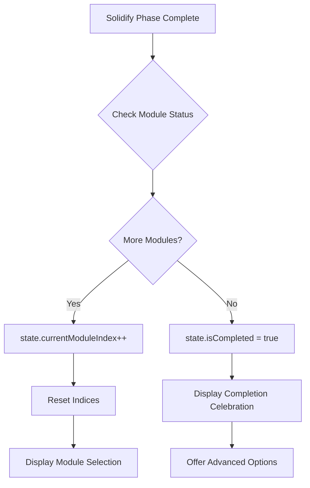

# Sensei System Teaching Workflow Architecture
*Last Updated: 2025-08-04*

## 🚀 Quick Start for Claude

**What is Sensei?** An adaptive AI teaching system that guides learners through a structured curriculum while continuously adapting to their learning state using sophisticated pedagogical strategies.

**Key Files to Understand the System:**
- `index.tsx` - Main entry point and orchestration (1200+ lines)
- `curriculum.ts` - Curriculum management and advancement logic (1000+ lines)
- `adaptiveEngine.ts` - Learner model and adaptation algorithms (800+ lines)
- `geminiService.ts` - LLM integration for teaching/analysis (300+ lines)
- `pedagogicalProfiler.ts` - Pedagogical strategy selection (400+ lines)

**Most Important Functions:**
- `generateNextSenseiResponse()` (index.tsx:318) - Main response generation
- `advanceCurriculumState()` (curriculum.ts:864) - Progress tracking
- `updateLearnerModel()` (adaptiveEngine.ts:313) - Learner state updates
- `generatePedagogicalGuidance()` (pedagogicalProfiler.ts:152) - Teaching adaptation

## Executive Summary

The Sensei system implements a sophisticated adaptive learning platform that guides users through a structured curriculum while continuously adapting to their learning state. This document details the complete architectural workflow from initial module listing through module completion.

## System Overview

The Sensei system operates through several interconnected phases:

1. **Initialization Phase**: System bootstrap and curriculum loading
2. **Module Selection Phase**: Interactive module presentation and selection
3. **Teaching Loop Phase**: Adaptive content delivery with continuous learner model updates
4. **Advancement Phase**: Progress tracking and module/curriculum completion

## 🏗️ Critical Data Structures

### Core Interfaces

```typescript
// curriculum.ts
interface Module {
    id: string;              // e.g., "1", "1.5", "2"
    title: string;           // e.g., "The Recursive Soul"
    goal: string;            // Module learning objective
    concepts: Concept[];     // Array of concepts to teach
    methodology: MethodologyStep[]; // Teaching methodology
    socratic: string;        // Socratic dialogue content
    solidify: string;        // Consolidation content
}

interface CurriculumState {
    moduleId: string;
    moduleName: string;
    currentModuleIndex: number;
    currentConceptIndex: number;
    currentPhase: PedagogicalPhase; // "IntroIllustrate" | "Socratic" | "Solidify"
    currentTeachingChunkIndex: number;
    teachingPlanForPhase: TeachingChunk[];
    isCompleted: boolean;
    phaseIntroduced: boolean;
    moduleStartTime: number;
    consolidationState?: ConsolidationState;
}

// adaptiveEngine.ts
interface LearnerModel {
    affectiveState: {
        confidence: number;      // 0-1 scale
        frustration: number;
        engagement: number;
        confusion: number;
        boredom: number;
        curiosity: number;
        overwhelm: number;
        selfEfficacy: number;
    };
    cognitiveState: {
        estimatedCognitiveLoad: number;
        recentPerformanceTrend: "Improving" | "Stable" | "Declining" | "Stalled";
        comprehensionSignals: {
            strongUnderstanding: number;
            partialUnderstanding: number;
            misunderstanding: number;
            noSignal: number;
        };
    };
    knowledgeComponents: Record<string, number>; // KC -> mastery value
    sessionMetrics: {
        totalInteractions: number;
        successfulExplanations: number;
        struggledConcepts: string[];
    };
}

// geminiService.ts
interface ComprehensiveAnalysis {
    affectiveState: AffectiveState;
    cognitiveLoad: CognitiveLoad;
    selfRegulatedLearning: SRLState;
    misconceptions: MisconceptionAnalysis;
    knowledgeComponents: KnowledgeComponentAnalysis;
    primaryIntent: LearnerIntent;
    contentPointAssessment: ContentPointAssessment[];
}
```

## Detailed Architectural Flow

### Phase 1: System Initialization

```mermaid
graph TD
    A[index.html:160 Loads] --> B[index.tsx:830 Bootstrap]
    B --> C[Fetch Modules.txt via HTTP]
    C --> D[parseModulesTxt() in curriculum.ts:406]
    D --> E[Initialize Gemini AI Services]
    E --> F[initializeLearnerModel() in adaptiveEngine.ts:163]
    F --> G[Display Module List via displayMessage()]
```

**Initialization Sequence:**
```typescript
// index.tsx:1152-1157 - Module Loading
fetch('Modules.txt')
    .then(response => response.text())
    .then(text => {
        curriculum = parseModulesTxt(text);
        displayAvailableModules();
    });

// adaptiveEngine.ts:163-227 - Learner Model Creation
export function initializeLearnerModel(): LearnerModel {
    return {
        affectiveState: {
            confidence: 0.5,
            frustration: 0.0,
            engagement: 0.7,
            // ... all fields initialized
        },
        knowledgeComponents: {},
        misconceptions: {}
    };
}
```

### Phase 2: Module Selection

```mermaid
graph TD
    A[User Views Module List] --> B{Input Method?}
    B -->|Click Button| C[handleModuleClick():1129]
    B -->|Type Text| D[handleUserInput():658]
    C --> E[handleClickedModuleSelection():800]
    D --> F[handleInitialModuleSelectionInternal():214]
    E --> G[Display Phase Selection]
    F --> G
    G --> H[User Selects Phase]
    H --> I[createCurriculumState():285]
    I --> J[generateTeachingPlanForConcept():40]
```

**Module Selection Code Flow:**
```typescript
// index.tsx:214-249 - Module Selection Logic
async function handleInitialModuleSelectionInternal(inputText: string): Promise<boolean> {
    // Pattern matching for module selection
    if (inputText.toLowerCase().includes("start curriculum")) {
        selectedModule = curriculum.modules[0];
    } else if (/\d+(\.\d+)?/.test(inputText)) {
        // Numeric selection: "1", "2.5", "module 3"
        selectedModule = curriculum.modules.find(m => m.id === moduleId);
    } else {
        // Title matching (minimum 3 characters)
        selectedModule = findModuleByPartialTitle(inputText);
    }
    
    if (selectedModule) {
        pendingModuleSelection = selectedModule;
        displayPhaseSelectionMessage();
        return true;
    }
    return false;
}
```

### Phase 3: Main Teaching Loop

The teaching loop is the heart of the system:

```mermaid
graph TD
    A[User Input] --> B[handleUserInput():658]
    B --> C{curriculumState exists?}
    C -->|No| D[Module Selection Flow]
    C -->|Yes| E[generateNextSenseiResponse():318]
    E --> F[getAnalysisFromGemini():134]
    F --> G[updateLearnerModel():313]
    G --> H[advanceCurriculumState():864]
    H --> I[generatePedagogicalGuidance():152]
    I --> J[createSystemInstructionForPhase():50]
    J --> K[getSenseiResponse():95]
    K --> L[displayMessage() with streaming]
    L --> M{Continue?}
    M -->|Yes| A
    M -->|No| N[Module/Curriculum Complete]
```

#### 3.1 User Input Processing (`index.tsx:658-738`)

```typescript
export async function handleUserInput() {
    const inputText = userInput.value.trim();
    
    // Special command handling
    if (inputText.toLowerCase() === 'mskip') {
        handleModuleSkip();
        return;
    }
    
    // Store in history
    userInputHistory.push({
        timestamp: Date.now(),
        text: inputText,
        intent: "unknown" // Will be analyzed
    });
    
    // Display user message
    displayMessage(inputText, "user");
    
    // Route to appropriate handler
    await generateNextSenseiResponse(inputText);
}
```

#### 3.2 Learner Analysis (`geminiService.ts:134-167`)

```typescript
export async function getAnalysisFromGemini(
    userResponse: string,
    lastSenseiResponse: string,
    currentTaskId: string,
    expectedContentPoints: string[]
): Promise<ComprehensiveAnalysis> {
    const prompt = GET_COMPREHENSIVE_ANALYSIS_PROMPT_FUNCTION(
        userResponse, 
        lastSenseiResponse, 
        currentTaskId, 
        expectedContentPoints
    );
    
    const result = await model_flash.generateContent({
        contents: [{ role: "user", parts: [{ text: prompt }] }],
        generationConfig: {
            temperature: 0.1,
            responseMimeType: "application/json",
            responseSchema: analysisResponseSchema
        }
    });
    
    return JSON.parse(result.response.text());
}
```

**Analysis Categories:**
- **Affective State**: confidence (0-1), engagement, frustration, confusion
- **Cognitive Load**: intrinsicDifficulty, extraneousLoadSignals, germaneLoadActive
- **SRL Behaviors**: planningBehavior, monitoringFrequency, helpSeekingStyle
- **Misconceptions**: { type, likelihood, evidence, reasoning }
- **Content Understanding**: { pointId, covered, understandingScore }

#### 3.3 Learner Model Update (`adaptiveEngine.ts:313-537`)

```typescript
export function updateLearnerModel(
    model: LearnerModel,
    analysis: ComprehensiveAnalysis,
    curriculumState: CurriculumState
): UpdateResult {
    // Asymmetrical smoothing for state updates
    const updateCategoricalState = (oldValue: number, newValue: number): number => {
        if (newValue > oldValue) {
            // More responsive to improvements (60/40 split)
            return oldValue * 0.4 + newValue * 0.6;
        } else {
            // More sticky for declines (30/70 split)
            return oldValue * 0.7 + newValue * 0.3;
        }
    };
    
    // Update affective states
    model.affectiveState.confidence = updateCategoricalState(
        model.affectiveState.confidence,
        analysis.affectiveState.confidence
    );
    
    // KC updates based on understanding signals
    analysis.knowledgeComponents.understandingSignals.forEach(signal => {
        const currentKC = model.knowledgeComponents[signal.kcId] || 0;
        if (signal.isPositive) {
            model.knowledgeComponents[signal.kcId] = Math.min(1, currentKC + 0.12);
        } else {
            model.knowledgeComponents[signal.kcId] = Math.max(0, currentKC - 0.07);
        }
    });
    
    // High-water mark for content points
    analysis.contentPointAssessment.forEach(assessment => {
        const pointId = assessment.pointId;
        const currentScore = getContentPointScore(pointId);
        if (assessment.understandingScore > currentScore) {
            setContentPointScore(pointId, assessment.understandingScore);
            if (assessment.understandingScore >= 0.7) {
                markContentPointCovered(pointId);
            }
        }
    });
}
```

#### 3.4 Curriculum Advancement (`curriculum.ts:864-936`)

```typescript
export function advanceCurriculumState(
    state: CurriculumState,
    learnerModel: LearnerModel,
    curriculumData: Curriculum,
    lastResponse?: ComprehensiveAnalysis
): boolean {
    // Check chunk completion
    const chunkComplete = isCurrentChunkComplete(state);
    
    if (!chunkComplete) {
        state.interactionsSinceLastAdvancement++;
        return false;
    }
    
    // Check if last chunk in phase
    const isLastChunk = state.currentTeachingChunkIndex >= 
                       state.teachingPlanForPhase.length - 1;
    
    if (!isLastChunk) {
        // Advance to next chunk
        state.currentTeachingChunkIndex++;
        state.interactionsSinceLastAdvancement = 0;
        return true;
    }
    
    // Phase completion check
    const phaseKC = calculatePhaseKCValue(state, learnerModel);
    
    if (phaseKC < PHASE_MASTERY_THRESHOLD) {
        // Enter consolidation
        state.consolidationState = {
            isActive: true,
            startedAt: Date.now(),
            targetKC: PHASE_MASTERY_THRESHOLD,
            attemptCount: 0
        };
        return false;
    }
    
    // Determine next phase
    const nextPhase = determinePhaseTransition(state, curriculumData);
    if (nextPhase) {
        transitionToPhase(state, nextPhase);
        return true;
    }
    
    // Module/curriculum complete
    state.isCompleted = true;
    return true;
}
```

**Advancement Rules:**
- **Chunk Advancement**: All teaching points covered (≥0.7 understanding)
- **Phase Advancement**: KC mastery ≥ 0.65 (PHASE_MASTERY_THRESHOLD)
- **Consolidation Trigger**: Phase complete but KC < 0.65
- **Socratic Special Case**: Completion triggers or 2x expected turns

#### 3.5 Pedagogical Guidance Generation (`pedagogicalProfiler.ts:152-188`)

```typescript
export function generatePedagogicalGuidance(
    learnerModel: LearnerModel,
    curriculumState: CurriculumState,
    recentInteractions: InteractionRecord[]
): PedagogicalGuidance {
    // Analyze learner state flags
    const activeFlags = detectActiveFlags(learnerModel, recentInteractions);
    
    // Critical intervention check
    const criticalFlags = activeFlags.filter(f => CRITICAL_FLAGS.includes(f));
    if (criticalFlags.length > 0) {
        return {
            primaryDirective: "MUST_OBEY: " + getCriticalIntervention(criticalFlags[0]),
            additionalGuidance: [],
            selectedPersona: "Crisis_Counselor"
        };
    }
    
    // Select appropriate teaching persona
    const persona = selectOptimalPersona(activeFlags, curriculumState.currentPhase);
    
    // Generate contextual guidance
    const guidance = generateContextualGuidance(
        activeFlags,
        learnerModel,
        curriculumState,
        persona
    );
    
    return {
        primaryDirective: guidance.primary,
        additionalGuidance: guidance.secondary,
        selectedPersona: persona,
        rationaleFlags: activeFlags
    };
}
```

**Flag Categories (30+ total):**
- **Affective**: High_Frustration, Low_Confidence, High_Anxiety
- **Cognitive**: Cognitive_Overload, Mental_Model_Gap, Deep_Thinking
- **Performance**: Performance_Stalled, Breakthrough_Moment, Rapid_Progress
- **Behavioral**: Passive_Engagement, Help_Seeking_Appropriate

#### 3.6 Response Generation (`interactionHelpers.ts:95-116`)

```typescript
export async function getSenseiResponse(
    userMessage: string,
    systemInstructions: string,
    messageHistory: ChatMessage[]
): Promise<string> {
    // Use persistent chat for context
    if (!persistentChat) {
        persistentChat = model_pro.startChat({
            history: messageHistory,
            systemInstruction: systemInstructions
        });
    }
    
    // Stream response for real-time display
    const result = await persistentChat.sendMessageStream(userMessage);
    
    let fullResponse = '';
    for await (const chunk of result.stream) {
        const chunkText = chunk.text();
        fullResponse += chunkText;
        await streamChunkToUI(chunkText); // Real-time display
    }
    
    return fullResponse;
}
```

### Phase 4: Module Completion & Progression



**Completion Code:**
```typescript
// curriculum.ts:729-769
function determinePhaseTransition(
    state: CurriculumState,
    curriculum: Curriculum
): PhaseTransition | null {
    const currentModule = curriculum.modules[state.currentModuleIndex];
    
    switch (state.currentPhase) {
        case "IntroIllustrate":
            if (state.currentConceptIndex < currentModule.concepts.length - 1) {
                // Next concept
                return {
                    phase: "IntroIllustrate",
                    conceptIndex: state.currentConceptIndex + 1
                };
            } else {
                // Move to Socratic
                return { phase: "Socratic" };
            }
            
        case "Socratic":
            // Always move to Solidify after Socratic
            return { phase: "Solidify" };
            
        case "Solidify":
            if (state.currentModuleIndex < curriculum.modules.length - 1) {
                // Next module
                return {
                    phase: "IntroIllustrate",
                    moduleIndex: state.currentModuleIndex + 1,
                    conceptIndex: 0
                };
            } else {
                // Curriculum complete
                return null;
            }
    }
}
```

## 🔧 Common Patterns & Troubleshooting

### Pattern 1: Adding New Teaching Strategies

To add a new teaching approach:
1. Add flag detection in `pedagogicalProfiler.ts:detectActiveFlags()`
2. Create intervention in `generateContextualGuidance()`
3. Update system instruction builder in `interactionHelpers.ts`

### Pattern 2: Modifying Advancement Logic

To change progression criteria:
1. Adjust `PHASE_MASTERY_THRESHOLD` in `curriculum.ts`
2. Modify `isCurrentChunkComplete()` logic
3. Update `calculatePhaseKCValue()` computation

### Pattern 3: Debugging Learner Model Updates

Common issues:
- **Erratic state changes**: Check smoothing coefficients
- **KC not updating**: Verify signal detection in analysis
- **Stuck in phase**: Check consolidation state and KC calculations

### Pattern 4: LLM Integration Issues

Troubleshooting:
- **Timeout errors**: Check `geminiService.ts` model initialization
- **JSON parse errors**: Verify response schema in `getAnalysisFromGemini()`
- **Context loss**: Ensure `persistentChat` is maintained

## 🎯 Key Performance Metrics

The system tracks:
- **Response Time**: Target < 3s for analysis, < 5s for teaching response
- **KC Progression Rate**: Average 0.1-0.15 per successful interaction
- **Advancement Rate**: 3-5 interactions per chunk typical
- **Completion Rate**: Module completion in 20-40 interactions

## 🏃 Quick Command Reference

**Special Commands:**
- `mskip` - Skip current module
- `start curriculum` - Begin with first module
- Module selection: `1`, `2.5`, `module 3`, or partial title

**Debug Helpers:**
- Check `logger.ts` for comprehensive logging
- Use browser console for real-time state inspection
- Footer shows current confidence/confusion/intent

## Critical Functions Reference

### Core Orchestration
- `generateNextSenseiResponse()` - index.tsx:318-518
- `handleUserInput()` - index.tsx:658-738
- `displayMessage()` - ui.ts:254-540

### Curriculum Management
- `advanceCurriculumState()` - curriculum.ts:864-936
- `createCurriculumState()` - curriculum.ts:285-326
- `calculateFocusStrategy()` - curriculum.ts:672-682

### Learner Adaptation
- `updateLearnerModel()` - adaptiveEngine.ts:313-537
- `initializeLearnerModel()` - adaptiveEngine.ts:163-227
- `calculatePerformanceTrend()` - adaptiveEngine.ts:229-268

### LLM Integration
- `getAnalysisFromGemini()` - geminiService.ts:134-167
- `getSenseiResponse()` - interactionHelpers.ts:95-116
- `generateTeachingPlanForConcept()` - geminiService.ts:40-131

### Pedagogical Intelligence
- `generatePedagogicalGuidance()` - pedagogicalProfiler.ts:152-188
- `detectActiveFlags()` - pedagogicalProfiler.ts:107-150
- `selectOptimalPersona()` - pedagogicalProfiler.ts:190-215

## System Invariants

1. **Only one `curriculumState` active at a time**
2. **Learner model updates are always smoothed**
3. **Content points use high-water marking**
4. **Phase transitions require KC threshold**
5. **Socratic phase is module-wide, not per-concept**

## Conclusion

The Sensei system represents a sophisticated orchestration of:
- **Structured Curriculum**: Well-defined learning paths with phases
- **Adaptive Intelligence**: Continuous learner model updates with 30+ signals
- **Pedagogical Expertise**: Evidence-based teaching strategies and personas
- **Technical Excellence**: Efficient state management and LLM integration

This architecture enables truly personalized learning experiences that adapt in real-time to each learner's needs while maintaining systematic progression through educational content.